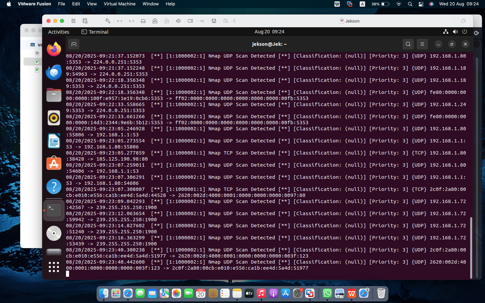
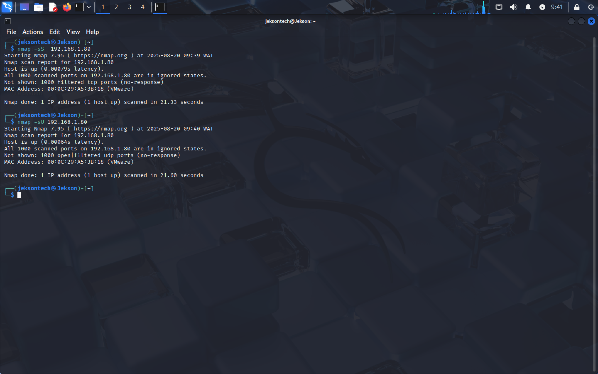
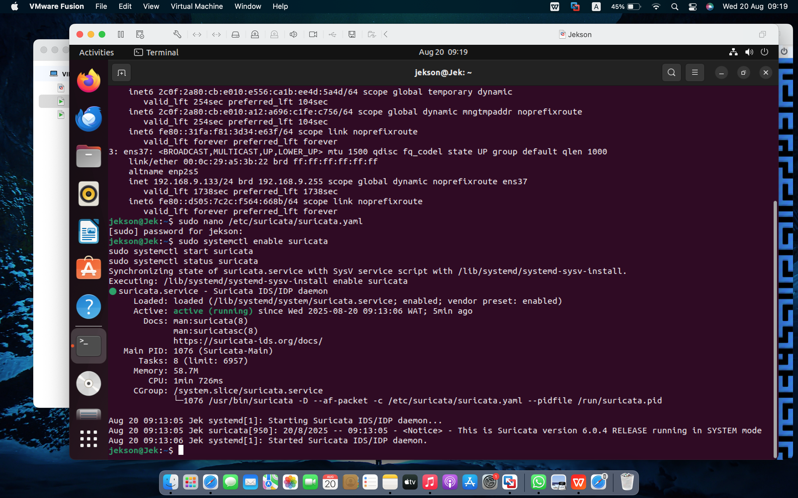
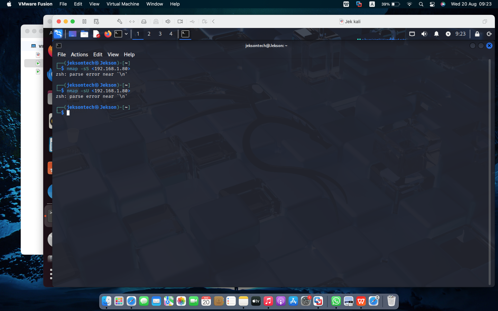
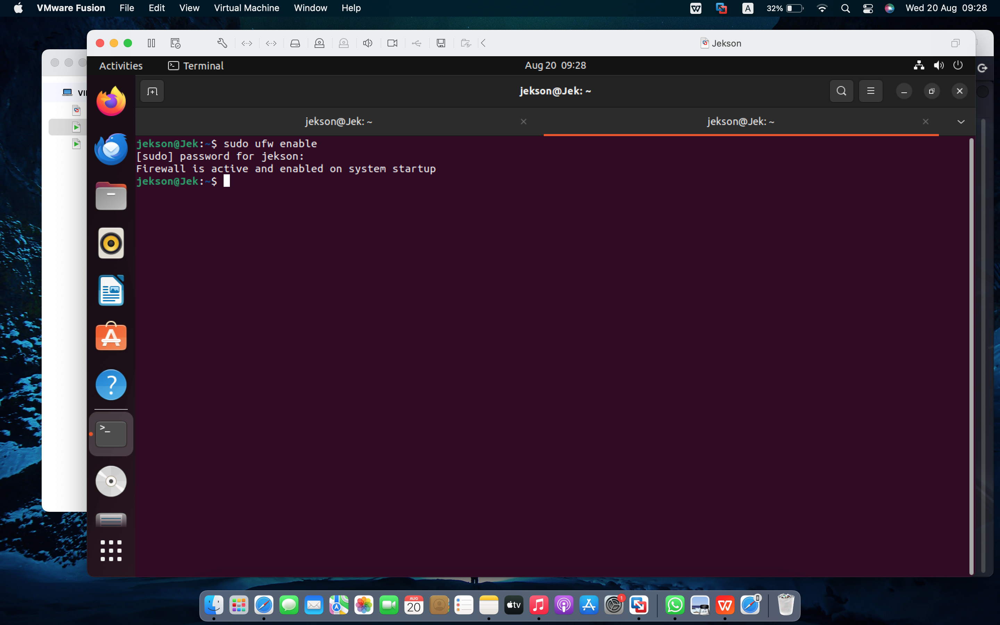
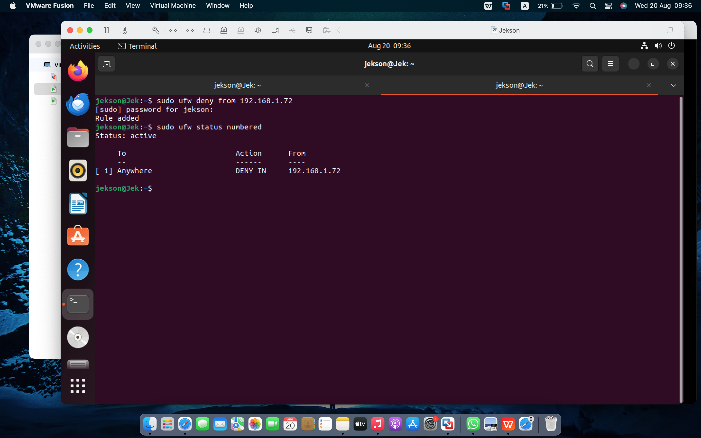
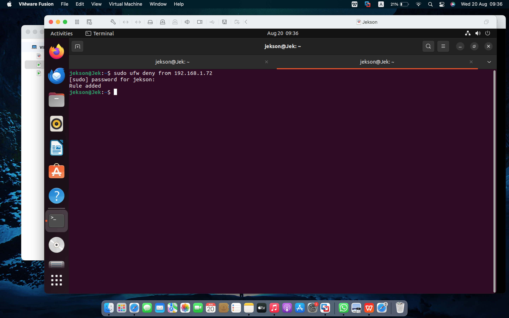

````md id="94jnzm"
# 🛡️ Enterprise SIEM Engineering: Automated Network Reconnaissance & Splunk Analytics

## 📋 1. Introduction

In modern enterprise cybersecurity operations, establishing rapid perimeter visibility and tracking operational configuration drift is critical.

This project demonstrates how **Nmap** can be systematically engineered for advanced host discovery and network reconnaissance, and how **Splunk Enterprise** can be leveraged as a centralized SIEM for data ingestion, event parsing, visualization, and automated alerting.

By combining scanning utilities with big-data analytics platforms, this lab creates an active monitoring framework capable of detecting exposed assets, monitoring network mutations over time, and generating alerts against high-risk anomalies.

---

# 🎯 2. Objectives

- Conduct high-fidelity network sweeps to identify live targets and exposed services
- Export reconnaissance data into structured XML format
- Ingest network telemetry into Splunk Enterprise
- Build Splunk dashboards for security visibility
- Create SIEM alerts for:
  - New hosts detected
  - Critical ports exposed
  - Service version changes

---

# 🛠️ 3. Tools & Infrastructure Matrix

| Technology | Purpose |
|---|---|
| Nmap | Host discovery & reconnaissance |
| Splunk Enterprise | SIEM monitoring & analytics |
| Kali Linux | Offensive scanning environment |
| macOS | Splunk deployment environment |
| VMware Fusion | Virtualization platform |

---

# 🚀 4. Technical Methodology

## 4.1 Passive Host Discovery (Ping Sweep)

```bash
nmap -sn 192.168.1.95/24
```

### 🖼️ Scan Verification

<p align="center">
  
</p>

---

## 4.2 Open Port Discovery

```bash
nmap -p 1-1000 192.168.1.95/24
```

---

## 4.3 Service Version Enumeration

```bash
nmap -sV 192.168.1.95
```

---

## 4.4 Remote Operating System Detection

```bash
nmap -O 192.168.1.95
```

---

## 4.5 Aggressive Network Profiling

```bash
nmap -A 192.168.1.95
```

---

## 4.6 Exporting Results to XML

```bash
nmap -sV -oX nmap_results.xml 192.168.1.95/24
```

---

# 📊 5. Splunk Data Ingestion Pipeline

## Splunk Upload Workflow

1. Open Splunk Web

```text
http://localhost:8000
```

2. Navigate to:

```text
Settings → Add Data → Upload File
```

3. Upload:

```text
nmap_results.xml
```

4. Configure:
- Source Type: `xml`
- Index Name: `nmap_index`

5. Verify successful ingestion.

---

# 📡 6. Splunk Analytics Queries

## Query 1 — Open Port Inventory

```spl
index=nmap_index "open"
```

### 🖼️ SIEM Visibility Evidence

<p align="center">
  
</p>

---

## Query 2 — Port Density Metrics by Host

```spl
index=nmap_index "open" | stats count by host
```

### 🖼️ Service Monitoring Validation

<p align="center">
  
</p>

---

# 🔥 7. Infrastructure Hardening & Firewall Enforcement

## Initial Firewall Rules Verification

<p align="center">
  
</p>

---

## Activating Host-Based Firewall Policies

<p align="center">
  
</p>

---

## Enforcing Explicit Deny Policies

<p align="center">
  
</p>

---

## Verifying Blocked IP Restrictions

<p align="center">
  
</p>

---

# 🚨 8. Alert Engineering

The SIEM environment was configured to generate automated alerts for:

- Unauthorized host discovery
- Critical port exposure
- Service version drift
- Suspicious infrastructure changes
- Unusual network activity patterns

---

# 📈 9. Results & Security Metrics

The monitoring architecture successfully achieved:

✅ Live host identification

✅ Open port enumeration

✅ Service version tracking

✅ SIEM data ingestion

✅ Threat visibility dashboards

✅ Automated security alerting

✅ Infrastructure monitoring

---

# 🧠 10. Security Value of the Project

This lab demonstrates how security teams can combine reconnaissance engines with centralized SIEM analytics to improve visibility and detect threats proactively.

The project showcases:
- Real-time infrastructure awareness
- Centralized telemetry ingestion
- Security event correlation
- Faster threat detection workflows
- Defensive monitoring capabilities

---

# 🔮 11. Operational Security Recommendations

- Automate recurring scans using cron jobs
- Integrate OpenVAS vulnerability telemetry
- Add email or Slack alerting
- Expand SIEM correlation rules
- Integrate incident response ticketing systems

---

# ✅ 12. Conclusion

This project demonstrates a practical enterprise workflow for proactive network monitoring using Nmap and Splunk Enterprise.

By integrating reconnaissance, telemetry ingestion, SIEM analytics, dashboard visualization, and automated alerting, the lab provides a strong foundation for SOC monitoring and threat detection operations.

The project strengthened practical skills in:
- SIEM Engineering
- Threat Detection
- Security Monitoring
- Network Reconnaissance
- Infrastructure Visibility
- Incident Response Concepts

---

# 👨‍💻 Author

## Sunday Ojeka

*Aspiring SOC Analyst | Cybersecurity Specialist*

Focused on:
- SOC Operations
- Threat Detection
- SIEM Engineering
- Incident Response
- Network Security
- Blue Team Operations
- Security Automation
```
